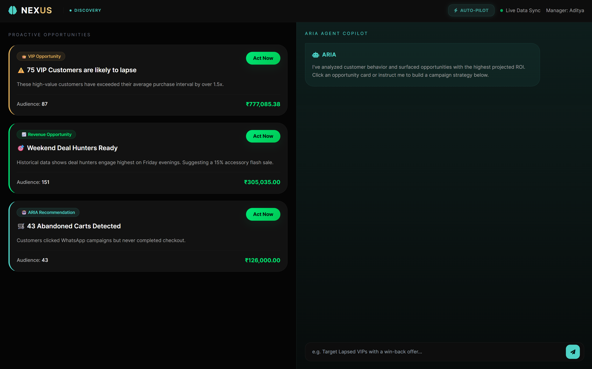
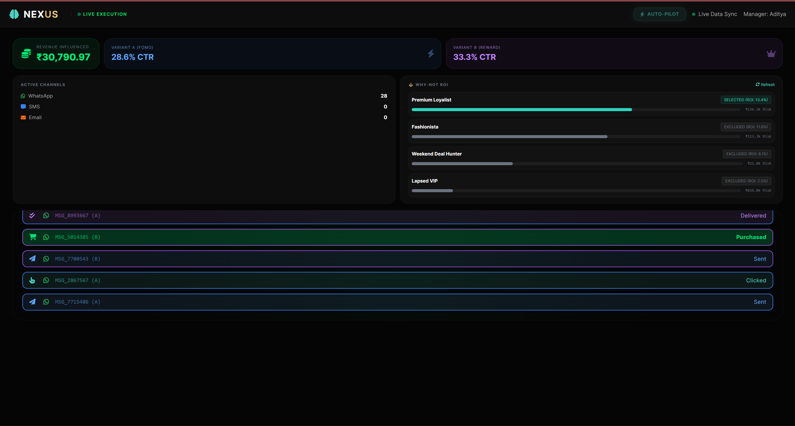
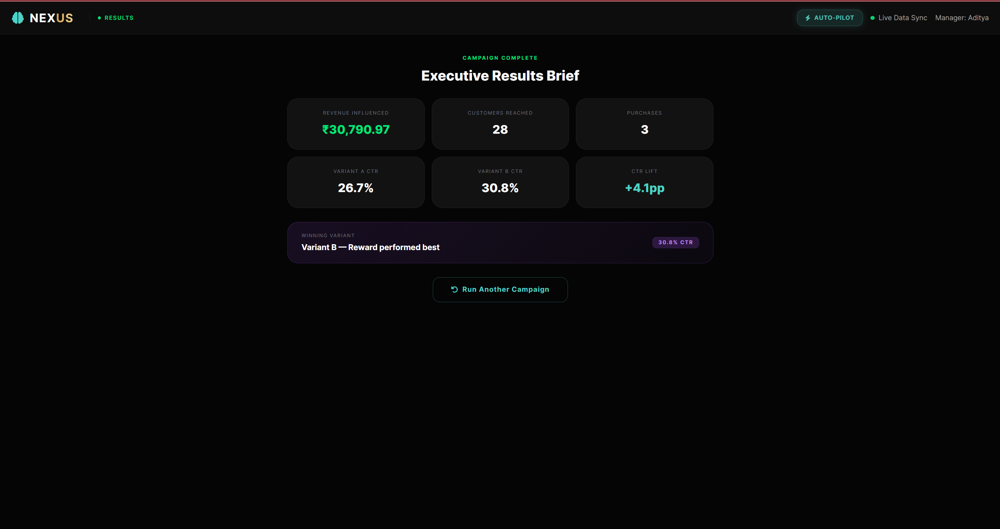

# NEXUS

> **AI-Native CRM that thinks, plans, and executes marketing campaigns autonomously.**

[](https://www.python.org/)
[](https://fastapi.tiangolo.com/)
[](https://www.sqlite.org/)
[](https://deepmind.google/technologies/gemini/)
[](https://render.com/)

---

## Demo

The NEXUS workflow spans across four operational pipeline states: Discovery, Campaign Planning, Live Execution (Theater), and Results.

| State 1 & 2: Discovery & Campaign Planning | State 3: Live Campaign Execution | State 4: Executive Performance Brief |
|:---:|:---:|:---:|
|  |  |  |

---
## Overview

At its core, NEXUS targets customer churn and delayed purchase intervals within e-commerce databases. By scanning customer demographic, purchase history, and engagement records, the platform uncovers hidden opportunities where revenue is at risk. 

Rather than relying on generic bulk marketing broadcasts, NEXUS integrates an autonomous AI agent, **ARIA**, powered by Google's `gemini-2.5-flash` model. ARIA acts directly on the local transactional database, pulling cohort records, segmenting buyers by behavioral personas (Premium Loyalists, Weekend Deal Hunters, Fashionistas, and Lapsed VIPs), and generating grounded marketing copy.

The system features a closed-loop learning architecture. Every campaign operates as a split-variant test (Variant A: FOMO/Scarcity vs. Variant B: Exclusivity/Rewards). When campaign dispatches run, message performance is logged through an active webhook stream. Once the campaign concludes, the best-performing variant is stored directly inside SQLite. Future campaigns targeting that persona inherit these findings as benchmark parameters, eliminating static rules in favor of dynamic learning.

---

## Features

* **Grounded AI Agent (ARIA):** Uses Google's Gemini SDK and SQLModel to execute structured database search tools (`segment_audience`, `get_next_best_action`, `get_persona_campaign_memories`, `generate_campaign_brief`) directly over SQLite tables.
* **Proactive Opportunity Detection:** Automatically recalculates customer churn scores and aggregates potential revenue at risk into active opportunity cards.
* **Closed-Loop Cognitive Campaign Memory:** Tracks historical variant performance (CTR, Open Rates, and Conversion Rates) in SQLite to inform and optimize copy tactics for subsequent campaign drafts.
* **A/B Split-Testing Engine:** Splices target lists 50/50 to generate distinct messaging types: high-urgency FOMO (Variant A) vs. prestige benefit statements (Variant B).
* **Decoupled Omnichannel Dispatch:** Automatically routes customer campaigns across WhatsApp, SMS, and Email channels based on behavioral persona demographics.
* **Real-time Performance Streaming:** Exposes campaign message transitions (Sent -> Delivered -> Opened -> Clicked -> Purchased) through structured webhook listeners, feeding the frontend UI via poll requests.

---

## Tech Stack

| Layer | Technology | Purpose |
| :--- | :--- | :--- |
| **Frontend** | Jinja2, Tailwind CSS, FontAwesome | Fast, responsive UI incorporating a 4-state workflow state machine. |
| **Backend Framework** | FastAPI (Python) | High-performance asynchronous API, routing chats, webhooks, and data streams. |
| **Database ORM** | SQLModel (SQLAlchemy + Pydantic) | Direct relational-to-object modeling for clean SQL generation. |
| **Database** | SQLite | Lightweight embedded SQL engine with transaction timeout parameters. |
| **Generative AI** | `google-genai` SDK (`gemini-2.5-flash`) | Core agent brain (ARIA) utilizing function calling, tool belts, and structured prompts. |
| **Carrier Simulation**| Async HTTPX, BackgroundTasks | Simulated network transmission times, channel-specific conversions, and failure retries. |

---

## Architecture

NEXUS is built using a decoupled, event-driven two-service architecture:

```
                      +---------------------------------------+
                      |               FRONTEND                |
                      |  - Interactive 4-State UI (Jinja2)    |
                      |  - Polling Endpoint: /api/theater/... |
                      +---+-------------------------------+---+
                          |                               ^
               Sends chat | POST /api/chat                | Real-time Updates
               & triggers | POST /api/dispatch            | (polls every 800ms)
                          v                               |
+-------------------------+-------------+                 |
|             CRM_BACKEND (Port 8000)   |                 |
|  - SQLite DB / SQLModel Engine        +-----------------+
|  - ARIA Agent (Gemini Tool Routing)   |
|  - Webhook Endpoint: /api/webhook/... |
+-------------------------+-------------+
                          |
                          | Dispatch Campaign Payload
                          | POST /api/dispatch
                          v
+-------------------------+-------------+
|          CHANNEL_SERVICE (Port 8001)  |
|  - Carrier Network Simulation         |
|  - Background Async Tasks             |
|  - Sends Webhooks with status reports +-------+
+---------------------------------------+       |
                    ^                           | Fires status webhooks
                    |                           | (Sent/Delivered/Opened/Clicked/Purchased)
                    +---------------------------+
```

### Event Lifecycle

1. **Discovery:** The manager selects an opportunity card on the frontend UI, sending a structured prompt to ARIA (`POST /api/chat`).
2. **Planning:** ARIA runs tools to calculate segment metrics and writes tailored copy for Variant A and Variant B.
3. **Dispatch:** Clicking "Launch Campaign" triggers the CRM backend to create a `Campaign` database entry, write multiple target `MessageLog` records with `Pending` status, and POST individual payload batches to the `CHANNEL_SERVICE` dispatcher.
4. **Simulation:** The Channel Service processes message lifecycles in the background, utilizing probability weights mapping to each channel type (WhatsApp, SMS, and Email).
5. **Webhook Stream:** The Channel Service continuously hits `/api/webhook/delivery` with delivery status transitions.
6. **Live Theater Polling:** The frontend UI queries `/api/theater/stream` every 800ms, displaying carrier state transitions as they occur.
7. **Cognitive Completion:** Upon processing all terminal dispatches, the Campaign is marked "Completed", and its split performance metrics are compiled and logged as a new `CampaignMemory` row for future grounding.

---

## Project Structure

```text
NEXUS_PROJECT/
├── requirements.txt            # Python environment packages
├── .env                        # Local system configuration variables
├── .gitignore                  # Git untracked pattern definitions
├── nexus_crm.db                # SQLite database (generated during runtime)
├── channel_service/            # Mock Telecom Carrier Microservice
│   └── main.py                 # FastAPI background dispatch simulator
└── crm_backend/                # Core AI CRM Application
    ├── __init__.py             # Package declaration
    ├── agent.py                # ARIA Agent: Google GenAI config, tools, and constraints
    ├── database.py             # SQLite connection pooling & SQLModel engine setup
    ├── main.py                 # Core API router, webhook handlers, and lifespan hooks
    ├── models.py               # SQLModel Database schema definitions
    ├── seed.py                 # Demographic database generation (500+ records)
    └── templates/              
        └── index.html          # Dynamic control dashboard, state engine, and poll loops
```

---

## Quickstart

### Local Setup and Installation

Follow these steps to run both services on your local machine:

1. **Clone the repository:**
   ```bash
   git clone https://github.com/yourusername/nexus.git
   cd nexus
   ```

2. **Create and activate a virtual environment:**
   ```bash
   python -m venv venv
   # On macOS/Linux:
   source venv/bin/activate
   # On Windows (PowerShell):
   .\venv\Scripts\Activate.ps1
   ```

3. **Install dependencies:**
   ```bash
   pip install -r requirements.txt
   ```

4. **Configure Local Environment Variables:**
   Create a `.env` file in the root folder:
   ```env
   GEMINI_API_KEY=your_actual_gemini_api_key_here
   CRM_WEBHOOK_URL=http://localhost:8000/api/webhook/delivery
   CHANNEL_SERVICE_URL=http://localhost:8001
   ```

5. **Seed the database (Optional):**
   The CRM backend will automatically seed on startup if no database is detected. To seed it manually, execute:
   ```bash
   python -m crm_backend.seed
   ```

6. **Running the Services:**
   You must run both servers concurrently. Use two terminal windows with your virtual environment active:

   * **Terminal 1: Run CRM Backend (Port 8000)**
     ```bash
     uvicorn crm_backend.main:app --host 127.0.0.1 --port 8000 --reload
     ```

   * **Terminal 2: Run Channel Service (Port 8001)**
     ```bash
     uvicorn channel_service.main:app --host 127.0.0.1 --port 8001 --reload
     ```

   Open your browser and navigate to `http://localhost:8000` to interact with NEXUS.

---

### Production Deployment (Render)

To deploy NEXUS onto Render's cloud platform, deploy both components as **Web Services**:

#### 1. CRM Backend Service (`crm_backend`)
* **Runtime:** Python
* **Build Command:** `pip install -r requirements.txt`
* **Start Command:** `uvicorn crm_backend.main:app --host 0.0.0.0 --port $PORT`
* **Environment Variables:**
  * `GEMINI_API_KEY` = `your_google_gemini_api_key`
  * `CHANNEL_SERVICE_URL` = `https://your-channel-service.onrender.com` (Use your actual Channel Web Service URL)

#### 2. Channel Service Simulator (`channel_service`)
* **Runtime:** Python
* **Build Command:** `pip install -r requirements.txt`
* **Start Command:** `uvicorn channel_service.main:app --host 0.0.0.0 --port $PORT`
* **Environment Variables:**
  * `CRM_WEBHOOK_URL` = `https://your-crm-backend.onrender.com/api/webhook/delivery` (Use your actual CRM Backend Web Service URL)

---

## Environment Variables

| Variable | Service | Description | Required | Default |
| :--- | :--- | :--- | :--- | :--- |
| `GEMINI_API_KEY` | `crm_backend` | Authentication key for Google's GenAI endpoint. | **Yes** | None |
| `CRM_WEBHOOK_URL` | `channel_service` | The URL where simulated carrier updates are posted. | **Yes** | `http://localhost:8000/api/webhook/delivery` |
| `CHANNEL_SERVICE_URL`| `crm_backend` | Endpoint used by CRM tools to dispatch campaigns. | **Yes** | `http://localhost:8001` |
| `BASE_DIR` | `crm_backend` | System path context override for locating HTML templates. | No | Relative path logic |

---

## API Reference

### CRM Backend Services (`crm_backend` - Port 8000)

| Method | Endpoint | Description |
| :--- | :--- | :--- |
| `GET` | `/` | Renders and returns the Jinja2 UI panel dashboard. |
| `GET` | `/api/opportunities` | Returns a JSON array of active Opportunity cards. |
| `POST`| `/api/opportunities/refresh`| Forces recalculation of customer counts and revenue at risk. |
| `GET` | `/api/customers` | Returns top 10 at-risk customers sorted by `churn_score DESC`. |
| `GET` | `/api/campaigns` | Returns all executed campaigns with aggregated funnel counts. |
| `GET` | `/api/analysis/why-not` | Computes comparative financial opportunity evaluations across cohorts. |
| `GET` | `/api/health` | Returns active SQLite engine and database metrics. |
| `POST`| `/api/chat` | Takes raw user text, passes it to ARIA, and returns an agent reply. |
| `POST`| `/api/webhook/delivery` | Endpoint for recording inbound delivery status states. |
| `GET` | `/api/theater/stream` | Stream endpoint returning events mapped to the latest campaign ID. |

### Channel Dispatcher Services (`channel_service` - Port 8001)

| Method | Endpoint | Description |
| :--- | :--- | :--- |
| `GET` | `/` | Simple health check to verify microservice status. |
| `POST`| `/api/dispatch` | Ingests bulk messages and queues background task workflows. |

---

## User Flow

### 1. Discovery State
Upon loading NEXUS, the application scans the database to surface **Proactive Opportunities** based on customer inactivity intervals. The manager selects an opportunity card (such as *"VIP Customers are likely to lapse"*), triggering an immediate transition to the Campaign Planning state.

```
+-------------------------------------------------------------+
|                    [PROACTIVE OPPORTUNITIES]                |
|                                                             |
|  [👑 VIP Customers Lapsing]        [🎯 Weekend Hunters]     |
|  Audience: 54 Customers            Audience: 142 Customers  |
|  Risk: ₹74,320                     Risk: ₹284,000           |
|  [ ACT NOW ]                       [ ACT NOW ]              |
+-------------------+-----------------------------------------+
                    |
                    | (Manager Clicks "Act Now")
                    v
```

### 2. Campaign Planning State
The UI transitions, prompting ARIA to generate a focused segment campaign strategy. ARIA calls database utility tools to verify customer variables, reviews prior copywriting strategies from its cognitive memory, and drafts A/B split-test messages. The UI displays performance metrics and messaging options for the planned campaign.

```
+-------------------------------------------------------------+
|                     [CAMPAIGN PLANNING]                     |
|                                                             |
|  Selected Opportunity: VIP Customers are likely to lapse    |
|  Audience Count: 54   |   Projected ROI: ~14.5%             |
|                                                             |
|  [⚡ Variant A: FOMO]         [👑 Variant B: Reward]        |
|  "⏳ URGENT: Limited Time..." "👑 VIP Access Benefit..."   |
|                                                             |
|                   [ LAUNCH CAMPAIGN ]                       |
+-------------------+-----------------------------------------+
                    |
                    | (Manager clicks "Launch Campaign")
                    v
```

### 3. Live Campaign Execution State
Clicking "Launch Campaign" triggers a background dispatch request, prompting the UI to switch to the Live Theater. The Channel Service simulates message delivery events, posting back status updates through webhooks. These status updates are streamed onto the interface in real time, shifting metrics, channel counts, and A/B CTR indicators.

```
+-------------------------------------------------------------+
|                      [LIVE EXECUTION]                       |
|                                                             |
|  Live Revenue Counter: ₹45,500                              |
|  Variant A: 12.4% CTR  |  Variant B: 8.2% CTR               |
|                                                             |
|  [MSG_2084931 (A)] ---> Opened                              |
|  [MSG_4091823 (B)] ---> Clicked                             |
|  [MSG_1029481 (A)] ---> Purchased  [₹4,500.00]              |
|  [MSG_3892019 (B)] ---> Sent                                |
+-------------------+-----------------------------------------+
                    |
                    | (All message logs hit terminal states)
                    v
```

### 4. Results State
When all messages reach a completed state (either converted or failed), the interface transitions to display the **Executive Performance Brief**. The screen outlines final revenue gains, conversion margins, and CTR variance. The system logs the winning variant directly into SQLite, building historical memory to guide subsequent campaign drafts.

```
+-------------------------------------------------------------+
|                    [EXECUTIVE RESULTS]                      |
|                                                             |
|  Total Revenue Influenced: ₹82,300                          |
|  Variant A CTR: 18.5%  |  Variant B CTR: 11.2%              |
|  Performance Lift: +7.3pp (Variant A Won)                   |
|                                                             |
|  [🧠 Cognitive Memory Updated]                              |
|  Stored benchmark record to Lapsed VIP Memory logs.         |
|                                                             |
|                  [ RUN ANOTHER CAMPAIGN ]                   |
+-------------------------------------------------------------+
```

---

## Known Limitations

* **Gemini Free Tier Rate Limits:** Since ARIA relies on the free tier of `gemini-2.5-flash`, rapid, sequential prompts may result in temporary `429 (Resource Exhausted)` API restrictions.
* **Render Cold Starts:** When deployed on Render free web service instances, the server may experience spin-down delays of up to 50 seconds during cold starts. Run an initial health ping (`GET /api/health`) to wake the server before demonstration.
* **Ephemeral SQLite on Render:** Render free-tier instances run on ephemeral filesystems. Database writes and learning loops (such as campaign creations and new cognitive memories) do not persist across server restarts unless deployed alongside a persistent disk mount.

---

## License

NEXUS is distributed under the [MIT License](LICENSE). Feel free to modify, distribute, and integrate the code for educational use or hackathon builds.